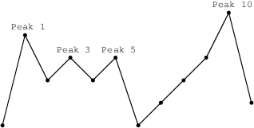

### Algorithm #29: Flags

[Codility](https://app.codility.com/programmers/lessons/10-prime_and_composite_numbers/flags/)

---

A non-empty array A consisting of N integers is given.

A peak is an array element which is larger than its neighbours. More precisely, it is an index P such that 0 < P < N − 1 and A[P − 1] < A[P] > A[P + 1].

For example, the following array A:

    A[0] = 1
    A[1] = 5
    A[2] = 3
    A[3] = 4
    A[4] = 3
    A[5] = 4
    A[6] = 1
    A[7] = 2
    A[8] = 3
    A[9] = 4
    A[10] = 6
    A[11] = 2

has exactly four peaks: elements 1, 3, 5 and 10.

You are going on a trip to a range of mountains whose relative heights are represented by array A, as shown in a figure below. You have to choose how many flags you should take with you. The goal is to set the maximum number of flags on the peaks, according to certain rules.

Flags can only be set on peaks. What's more, if you take K flags, then the distance between any two flags should be greater than or equal to K. The distance between indices P and Q is the absolute value |P − Q|.

For example, given the mountain range represented by array A, above, with N = 12, if you take:

two flags, you can set them on peaks 1 and 5;
three flags, you can set them on peaks 1, 5 and 10;
four flags, you can set only three flags, on peaks 1, 5 and 10.
You can therefore set a maximum of three flags in this case.

Write a function:

class Solution { public int solution(int[] A); }

that, given a non-empty array A of N integers, returns the maximum number of flags that can be set on the peaks of the array.

For example, the following array A:

    A[0] = 1
    A[1] = 5
    A[2] = 3
    A[3] = 4
    A[4] = 3
    A[5] = 4
    A[6] = 1
    A[7] = 2
    A[8] = 3
    A[9] = 4
    A[10] = 6
    A[11] = 2

the function should return 3, as explained above.

Write an efficient algorithm for the following assumptions:

N is an integer within the range [1..400,000];
each element of array A is an integer within the range [0..1,000,000,000].
Copyright 2009–2021 by Codility Limited. All Rights Reserved. Unauthorized copying, publication or disclosure prohibited.
